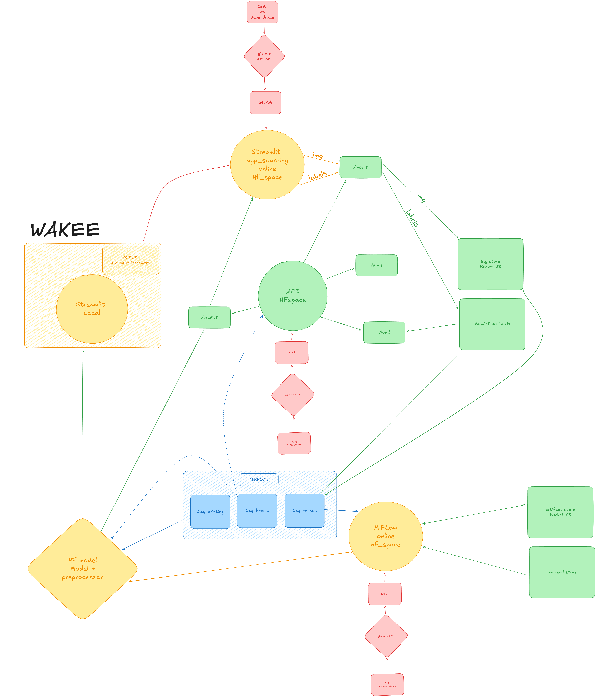

# 🦁 Wakee - Emotion Detection MLOps Pipeline

> **Production-grade MLOps pipeline for real-time emotion detection in educational settings**

[](https://www.python.org/)
[](https://www.docker.com/)
[](https://airflow.apache.org/)
[](https://mlflow.org/)
[](LICENSE)

**Wakee** is an end-to-end MLOps system that detects student emotions (boredom, confusion, engagement, frustration) from facial expressions to improve learning experiences. Built with production-grade automation, monitoring, and continuous retraining capabilities.

---

## 📊 Project Overview

### **Problem Statement**
Traditional education lacks real-time feedback on student engagement. Wakee bridges this gap by automatically detecting emotions from webcam footage, enabling educators to adapt their teaching strategies dynamically.

### **Key Features**
- 🎯 **4-emotion detection** (boredom, confusion, engagement, frustration)
- 🚀 **Real-time inference** via FastAPI (< 100ms latency)
- 🔄 **Automated retraining** pipeline with drift detection
- 📈 **Experiment tracking** with MLflow
- 🛡️ **Model validation** and rollback strategy
- 🎨 **Interactive annotation** app for data labeling
- 📊 **Production monitoring** with Evidently AI

---

## 🏗️ Architecture



### **System Components**

#### **1. Data Collection & Annotation** (02_app_sourcing)
- **Streamlit app** for webcam capture and emotion labeling
- Stores images in **Cloudflare R2** (S3-compatible)
- Labels saved to **NeonDB PostgreSQL**
- Real-time preview and validation

#### **2. Inference API** (01_API)
- **FastAPI** REST endpoint for emotion prediction
- **ONNX Runtime** for optimized inference
- Model caching and batch processing
- Deployed on **HuggingFace Spaces**

#### **3. MLOps Pipeline** (03_Airflow)
Three orchestrated DAGs:

**a) Health Check DAG**
- Monitors API availability
- Tests database connectivity
- Validates model accessibility

**b) Drift Detection DAG**
- Compares predictions vs user annotations
- Calculates MAE metrics per emotion
- Triggers retraining if drift > 0.15
- Generates **Evidently AI** reports

**c) Model Retraining DAG**
```
Download Baseline → Convert ONNX→PyTorch → Fetch Training Data
    ↓
Fine-tune (freeze backbone) → Validate New Model
    ↓
Decision: APPROVE → Export new ONNX → Upload to HF Hub
          REJECT  → Keep baseline    → Log to MLflow
```

#### **4. Experiment Tracking** (04_mlflow)
- **MLflow** deployed on HuggingFace Spaces
- PostgreSQL backend for metadata
- Tracks metrics, parameters, artifacts
- Model registry with versioning

#### **5. Legacy Demo** (00_wakee)
- Original Streamlit proof-of-concept
- Combines inference + LLM recommendations
- Kept for comparison and demos

---

## 🛠️ Technology Stack

### **Machine Learning**
- **Framework:** PyTorch 2.1.2
- **Architecture:** EfficientNet-B4 (pretrained ImageNet)
- **Dataset:** DAiSEE + custom annotations
- **Optimization:** ONNX Runtime (3x faster inference)

### **MLOps & Orchestration**
- **Workflow:** Apache Airflow 2.8
- **Tracking:** MLflow 2.9
- **Monitoring:** Evidently AI
- **CI/CD:** GitHub Actions (planned)

### **Infrastructure**
- **Compute:** Docker Compose (local) / Kubernetes (future)
- **Database:** NeonDB PostgreSQL (serverless)
- **Storage:** Cloudflare R2 (S3-compatible)
- **Model Hub:** HuggingFace Spaces
- **API Gateway:** FastAPI + Uvicorn

### **Deployment**
- **Containerization:** Docker + Docker Compose
- **API Hosting:** HuggingFace Spaces
- **MLflow Hosting:** HuggingFace Spaces
- **Orchestration:** Airflow (local/cloud)

---

## 📂 Project Structure

```
wakee-reloaded/
├── 00_wakee/                    # Legacy demo app
│   ├── app.py                   # Streamlit app (inference + LLM)
│   ├── cnn.py                   # Model wrapper
│   └── llm.py                   # LLM integration
│
├── 01_API/                      # Production inference API
│   ├── app.py                   # FastAPI endpoints
│   ├── Dockerfile               # API containerization
│   └── requirements.txt
│
├── 02_app_sourcing/             # Data annotation tool
│   ├── app.py                   # Streamlit annotation app
│   ├── Dockerfile
│   └── requirements.txt
│
├── 03_Airflow/                  # MLOps orchestration
│   ├── dags/
│   │   ├── dag_drift_detection.py    # Drift monitoring
│   │   ├── dag_health_check.py       # System health
│   │   └── dag_model_retrain.py      # Automated retraining
│   ├── utils/
│   │   ├── data_loader.py            # R2 + NeonDB fetching
│   │   ├── database_helpers.py       # DB operations
│   │   ├── drift_calculator.py       # Evidently AI metrics
│   │   ├── hf_uploader.py            # HuggingFace Hub API
│   │   ├── model_trainer.py          # Fine-tuning logic
│   │   ├── model_validator.py        # Validation & rollback
│   │   ├── onnx_converter.py         # ONNX ↔ PyTorch
│   │   └── onnx_exporter.py          # ONNX export
│   ├── tests/                        # Unit & integration tests
│   ├── docker-compose.yaml           # Airflow setup
│   └── requirements.txt
│
├── 04_mlflow/                   # Experiment tracking
│   ├── Dockerfile               # MLflow server
│   └── requirements.txt
│
├── 05_scripts/                  # Setup & utilities
│   ├── init_db.py               # Database initialization
│   ├── create_drift_reports_table.sql
│   ├── create_model_versions_table.sql
│   ├── first_load_hfmodel.py    # Initial model upload
│   ├── onnx_to_pytorch.py       # Model conversion
│   └── test_r2.py               # Storage testing
│
├── architecture.png          # System architecture diagram
├── structure.txt             # Project structure
├── env_requirements.txt         # Global dependencies
├── .env.example                 # Environment template
├── LICENSE
└── README.md
```

---

## 🚀 Quick Start

### **Prerequisites**
- Docker & Docker Compose
- Python 3.11+
- 8GB RAM minimum
- HuggingFace account (for model hosting)
- Cloudflare R2 account (for image storage)
- NeonDB account (for database)

### **1. Clone Repository**
```bash
git clone https://github.com/Terorra/wakee-reloaded.git
cd wakee-reloaded
```

### **2. Configure Environment**
```bash
cp .env.example .env
# Edit .env with your credentials:
# - NEONDB_WR (PostgreSQL connection string)
# - R2_ACCESS_KEY_ID, R2_SECRET_ACCESS_KEY
# - HF_TOKEN (HuggingFace API token)
# - MLFLOW_TRACKING_URI
```

### **3. Initialize Database**
```bash
python 05_scripts/init_db.py
```

### **4. Start Airflow**
```bash
cd 03_Airflow
docker-compose up -d
```

Access Airflow UI: http://localhost:8080 (user: `airflow` / pass: `airflow`)

### **5. Run Inference API (Optional)**
```bash
cd 01_API
docker build -t wakee-api .
docker run -p 8000:8000 --env-file ../.env wakee-api
```

Test API: http://localhost:8000/docs

### **6. Launch Annotation App (Optional)**
```bash
cd 02_app_sourcing
docker build -t wakee-annotator .
docker run -p 8501:8501 --env-file ../.env wakee-annotator
```

Access app: http://localhost:8501

---

## 📈 Usage

### **Annotate Training Data**
1. Open annotation app (http://localhost:8501)
2. Capture images via webcam
3. Label emotions (0-3 scale)
4. Validate and submit annotations
5. Data automatically uploaded to R2 + NeonDB

### **Monitor Model Drift**
1. Airflow UI → DAGs → `drift_detection`
2. Trigger manually or wait for schedule (daily)
3. View Evidently reports in logs
4. Check `drift_reports` table in NeonDB

### **Trigger Model Retraining**
1. Airflow UI → DAGs → `model_retrain_safe`
2. Pipeline automatically:
   - Downloads baseline ONNX from HF Hub
   - Fetches validated annotations from NeonDB
   - Fine-tunes classifier (frozen backbone)
   - Validates new model vs baseline
   - Deploys if APPROVE, keeps baseline if REJECT
3. Track experiments in MLflow

### **Query Inference API**
```python
import requests
import base64

# Read image
with open("student.jpg", "rb") as f:
    img_b64 = base64.b64encode(f.read()).decode()

# Predict
response = requests.post(
    "http://localhost:8000/predict",
    json={"image": img_b64}
)

emotions = response.json()["emotions"]
print(f"Boredom: {emotions['boredom']:.2f}")
print(f"Engagement: {emotions['engagement']:.2f}")
```

---

## 🧪 Testing

```bash
cd 03_Airflow
pytest tests/ -v
```

**Test coverage:**
- API health checks
- Database connectivity
- Model loading
- R2 storage operations
- Drift calculation
- ONNX conversion

---

## 📊 Model Performance

### **Base Model (EfficientNet-B4)**
- **Dataset:** DAiSEE (9,068 videos, 112 students)
- **Preprocessing:** Face detection + crop to 224x224
- **Training:** Transfer learning from ImageNet
- **Optimizer:** Adam (lr=1e-4)
- **Loss:** MSE (regression)

### **Metrics (Test Set)**
| Emotion      | MAE   | RMSE  |
|--------------|-------|-------|
| Boredom      | 0.523 | 0.712 |
| Confusion    | 0.487 | 0.658 |
| Engagement   | 0.612 | 0.834 |
| Frustration  | 0.445 | 0.601 |
| **Average**  | **0.517** | **0.701** |

### **Inference Performance**
- **PyTorch:** ~45ms per image
- **ONNX:** ~15ms per image (3x faster)
- **Batch processing:** Supports up to 32 images/batch

---

## 🔄 MLOps Pipeline Details

### **Drift Detection Strategy**
```python
# Triggers retraining if:
if global_mae > 0.15:  # MAE threshold
    trigger_retraining()

if drift_detected_3_consecutive_days:
    alert_team()
```

### **Retraining Strategy**
1. **Freeze backbone** (EfficientNet features)
2. **Fine-tune classifier only** (4-class head)
3. **Validation criteria:**
   - New model variance > 0.001 (not constant)
   - New model variance < 0.1 (not overfitting)
   - Mean difference from baseline < 0.5
4. **Rollback if validation fails**

### **Model Versioning**
- **Format:** `v_YYYYMMDD_HHMM` (e.g., `v_20260210_1430`)
- **Storage:** HuggingFace Hub
- **Registry:** MLflow Model Registry
- **Rollback:** Automatic if validation fails

---

## 🛡️ Production Best Practices

### **Implemented**
✅ Automated health checks  
✅ Drift detection & alerting  
✅ Model validation before deployment  
✅ Rollback strategy  
✅ Experiment tracking (MLflow)  
✅ Containerized deployments  
✅ Structured logging  
✅ Database migrations  
✅ Unit & integration tests  

### **Planned**
🔄 Kubernetes deployment  
🔄 CI/CD with GitHub Actions  
🔄 A/B testing framework  
🔄 Prometheus + Grafana monitoring  
🔄 Slack/email alerting  
🔄 Load balancing & auto-scaling  

---

## 🤝 Contributing

Contributions welcome! Please:
1. Fork the repository
2. Create a feature branch (`git checkout -b feature/amazing-feature`)
3. Commit changes (`git commit -m 'Add amazing feature'`)
4. Push to branch (`git push origin feature/amazing-feature`)
5. Open a Pull Request

---

## 📝 License

This project is licensed under the MIT License - see [LICENSE](LICENSE) file.

---

## 🙏 Acknowledgments

- **Dataset:** [DAiSEE - Dataset for Affective States in E-learning](https://iith.ac.in/~daisee-dataset/)
- **Base Model:** EfficientNet-B4 (pretrained on ImageNet)
- **Infrastructure:** HuggingFace Spaces, NeonDB, Cloudflare R2
- **Frameworks:** PyTorch, Airflow, MLflow, FastAPI, Streamlit

---

## 📧 Contact

**Terorra** - [@Terorra](https://github.com/Terorra)

**Project Link:** https://github.com/Terorra/wakee-reloaded

---

## 🎓 Academic Context

This project was developed as part of the **Artificial Intelligence Architect (AIA)** certification program. It demonstrates:
- End-to-end MLOps pipeline development
- Automated model lifecycle management
- Production-grade deployment practices
- Real-world problem solving with AI

**Evaluation Criteria Met:**
✅ Relevant dataset selection & preprocessing  
✅ Model training with hyperparameter tuning  
✅ Complete MLOps pipeline (deployment → monitoring → retraining)  
✅ Full automation with CI/CD  
✅ Scalable architecture with monitoring  
✅ Comprehensive documentation  

---

<div align="center">

**⭐ If you find this project useful, please star it! ⭐**

Made with ❤️ by Terorra

</div>
